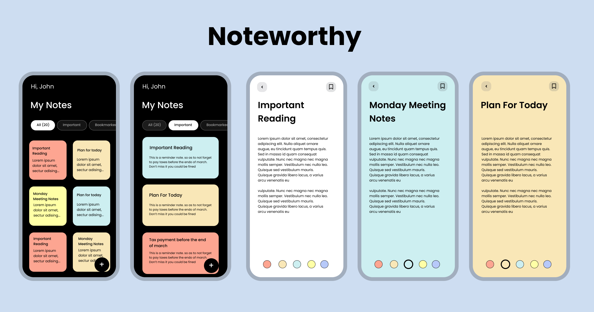

# Noteworthy

Note-taking app

## Architecture
- Riverpod App Architecture with the Controller-Service-Repository Pattern
- Firebase (authenticaion and database)

# Resources

[Flutter Documentation](https://docs.flutter.dev)

[Crypto Compare Documentation](https://min-api.cryptocompare.com/documentation?key=Toplists&cat=TopTotalVolumeEndpointFull)

[BLoC](https://bloclibrary.dev/#/)
