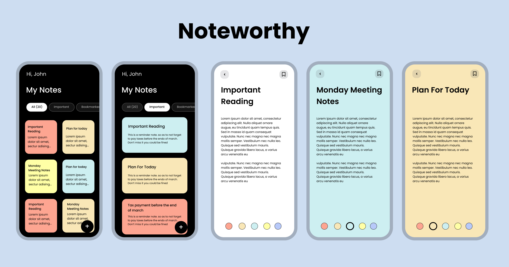

# Noteworthy

A cross-platform note-taking app built with Flutter and Firebase.



## Tech stack

| Layer | Technology |
|---|---|
| Frontend | Flutter (Material 3, Poppins) |
| State management | Riverpod 2 (code-generated providers) |
| Navigation | GoRouter |
| Backend | Firebase Auth + Cloud Firestore |
| Testing | flutter_test, mocktail, fake_cloud_firestore |

## Prerequisites

- Flutter SDK `>=3.2.0`
- A Firebase project with **Authentication** (email/password) and **Firestore** enabled
- `flutterfire` CLI or manually placed `google-services.json` / `GoogleService-Info.plist`

## Getting started

```bash
# 1. Install dependencies
flutter pub get

# 2. Regenerate Riverpod providers (only needed after changing @riverpod annotations)
flutter pub run build_runner build --delete-conflicting-outputs

# 3. Run the app
flutter run
```

## Running tests

```bash
# All tests
flutter test

# Single file
flutter test test/src/features/notes/data/notes_repository_test.dart
```

## Architecture

The project follows a **feature-first, clean architecture** layout:

```
lib/
├── features/
│   ├── authentication/   # Sign in/up — AuthRepository + controllers
│   └── notes/            # CRUD notes — NotesRepository + controllers
├── routing/              # GoRouter routes and auth-based redirects
├── common_widgets/       # Shared UI components
├── constants/            # Colors, sizes, breakpoints
└── exceptions/           # AppException sealed class
```

Each feature has three layers:

- **data/** — Repository that talks directly to Firebase (Firestore `withConverter`, Auth)
- **domain/** — Plain Dart models (`Note`, `AppUser`) with `Equatable` and `copyWith`
- **presentation/** — Screens + `AsyncNotifier` controllers that call the repository and update UI state

Unauthenticated users are automatically redirected to sign-up via a GoRouter `refreshListenable` on the auth stream.

## CI

| Workflow | Trigger |
|---|---|
| `test.yml` — `flutter test` | Every push |
| `dart.yml` — `dart analyze` | Push / PR to `main` |
